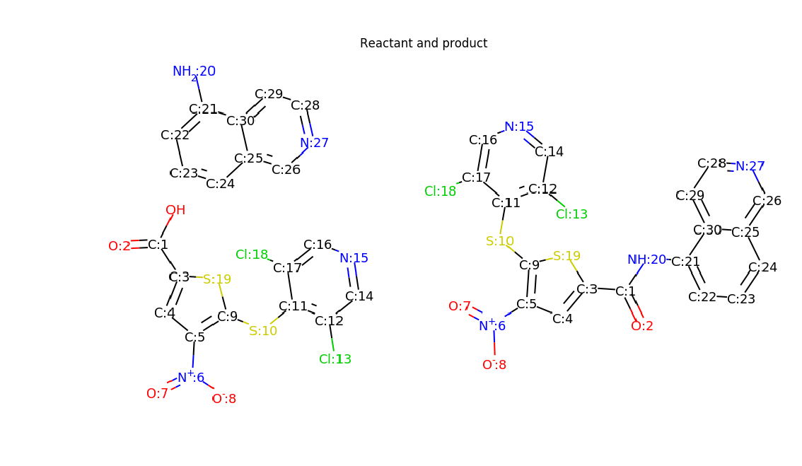
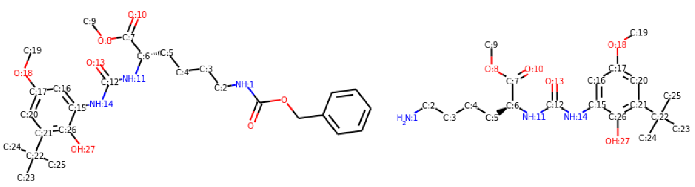

## Update (5/17/2021):

We adjusted our method slightly and the final Top-1 retrosynthesis accuracy is 62.1% for the known reaction type case, and 50.4% for the unknown reaction type case. Detailed are in the below table. We are still continually improving and updating the results. The revised paper and implementation will come later.  

|               | Top-1  | Top-3 | Top-5 | Top-10 | Top-20 | Top-50 |
| -----------   | ------ | ----- | ------| -------| -------| -------|
| With types    | 62.1%  | 75.8% | 78.5% | 80.9%  |  82.8% |  83.5% |
| Without types | 50.4%  | 61.1% | 62.3% | 63.4%  |  63.9% |  64%   |


## Important update (4/13/2021):

It is very unfortunate that we found a major information leak in our implementation, which leads to the superior retrosynthesis performance.
We will fix the issue and update our method in future!

As we mentioned in the [issue thread](https://github.com/uta-smile/RetroXpert/issues/10#issuecomment-803699582), there may be an information leak issue for the USPTO dataset if not handled properly. 
We found the original atom order of USPTO product SMILES may indicate the reaction atoms (atom property changes during the reaction). 
To be more specific, for most USPTO reactions (will update detailed statistic later), **the first product atom (with mapping number 1) usually belongs to reaction atoms (may have multiple reaction atoms)**. 

### Information leak issue with USPTO-50K dataset
To make the issue more clear, here are two example reactions from USPTO-50K train data:

```
# Example 1: reaction id US20120114765A1

Reactant: "O[C:1](=[O:2])[c:3]1[cH:4][c:5]([N+:6](=[O:7])[O-:8])[c:9]([S:10][c:11]2[c:12]([Cl:13])[cH:14][n:15][cH:16][c:17]2[Cl:18])[s:19]1.[NH2:20][c:21]1[cH:22][cH:23][cH:24][c:25]2[cH:26][n:27][cH:28][cH:29][c:30]12"
```

```
Product: "[C:1](=[O:2])([c:3]1[cH:4][c:5]([N+:6](=[O:7])[O-:8])[c:9]([S:10][c:11]2[c:12]([Cl:13])[cH:14][n:15][cH:16][c:17]2[Cl:18])[s:19]1)[NH:20][c:21]1[cH:22][cH:23][cH:24][c:25]2[cH:26][n:27][cH:28][cH:29][c:30]12"
```




In the example reaction 1 (id: US20120114765A1), the reaction atoms are [C:1] and [N:20].
Here the first product atom [C:1] belongs to the reaction atoms.
During the retrosynthesis, the bond between atoms [C:1] and [N:20] is disonnected.


```
# Example 2: reaction id US05849732

Reactant: "O=C(OCc1ccccc1)[NH:1][CH2:2][CH2:3][CH2:4][CH2:5][C@@H:6]([C:7]([O:8][CH3:9])=[O:10])[NH:11][C:12](=[O:13])[NH:14][c:15]1[cH:16][c:17]([O:18][CH3:19])[cH:20][c:21]([C:22]([CH3:23])([CH3:24])[CH3:25])[c:26]1[OH:27]"
```

```
Product: "[NH2:1][CH2:2][CH2:3][CH2:4][CH2:5][C@@H:6]([C:7]([O:8][CH3:9])=[O:10])[NH:11][C:12](=[O:13])[NH:14][c:15]1[cH:16][c:17]([O:18][CH3:19])[cH:20][c:21]([C:22]([CH3:23])([CH3:24])[CH3:25])[c:26]1[OH:27]"
```


In the example reaction 2 (id: US05849732), the reaction atoms are [N:1] and the unmapped [C]. Here first product atom [N:1] belongs to the reaction atoms again.


### Problem in our implementation

We tried to avoid the problem by canonicalizing the product SMILES by re-arranging the atom order to be the same as the canonical atom order, hoping to remove the potential information leak.
Specifically, as in [canonicalize_products.py](https://github.com/uta-smile/RetroXpert/blob/main/canonicalize_products.py#L20), we remove the original numbers from product and canonicalize the product SMILES so that its atom order is canonical.
Then we add the original mapping numbers to the associated atoms since our method needs aton-mapped reactions.

The problem of our [implementation](https://github.com/uta-smile/RetroXpert/blob/main/preprocessing.py#L173) is that when preparing the synthons for the second stage reactant generation, the molecule is canonicalized when converting to SMILES.
We were not aware that Rdkit canonicalization would arrange atoms according to the mapping numbers (ascending order), as a result, the first atom of the synthon (starting atom with mapping number 1) belongs to reaction atoms.
It turns out that this information leak will help the model predictions.
We thought the Rdkit canonicalization should always arrange atoms order for a SMILES in some canonical order, so we did not check the procedure [implementation](https://github.com/uta-smile/RetroXpert/blob/main/preprocessing.py#L173) carefully. 

### How to remove information leak

In our original [canonicalize_products.py](https://github.com/uta-smile/RetroXpert/blob/main/canonicalize_products.py#L20) implementation, we tried to remove the information leak by re-arranging atom order without re-assigning the mapping numbers.
However, it turns out that the rdkit canonicalization will take the mapping numbers into consideration. There still may be an information leak if not handled properly, as in our case.
To completely remove the information leak, we propose to **not only re-arranging product atom order, but also re-assign the mapping numbers according to the canonical atom order**.
For more details, please refer to the updated [canonicalize_products.py](https://github.com/uta-smile/RetroXpert/blob/canonical_product/canonicalize_products.py) implementation.

We recommend to use our latest canonicalization method to preprocess USPTO datasets.

<br/><br/> 
<br/><br/> 


## Reference implementation of our NeurIPS2020 paper [RetroXpert: Decompose Retrosynthesis Prediction Like A Chemist](https://arxiv.org/pdf/2011.02893.pdf) 


The final results may slightly different from those reported in the paper. We are continuously improving the implementation after the acceptance. 
For example, directed edges are adopted in the implementation, and previous implementation requires both directed edges are correctly predicted to be disconnected for each bond disconnection.
We later change the implementation slightly to combine the predictions for each bond. This improves the reaction center prediction accuracy slightly, but can not improve the final accuracy.

## Conda environment
We recommend to new a Conda environment to run the code. We use Pytorch 1.3, DGL 0.4.2, OpenNMT-py 1.0.0, and Rdkit 2019.03.4.0. It should be okay to use the latest Rdkit version with some slight changes accordingly. Please refer to the *requirements.txt* file for detailed packages.

Please refer to the OpenNMT-py/README.md for how to install the openmnt package. 

## Step-1: Product bond disconnection prediction

In the main directory (*~/RetroXpert/*)

1. Run data preprocessing, this will preprocess the USPTO-50K dataset to prepare required labels and DGL graphs.
```
python preprocessing.py
```
2. Extract semi-template patterns.
```
# extract semi-tempaltes for training data
python extract_semi_template_pattern.py --extract_pattern

# find semi-template patterns for all data
python extract_semi_template_pattern.py
```
3. Start to train EGAT model with reaction category
```
python train.py --typed
```

4. Evaluate the EGAT model
```
# evaluate on test data
python train.py --typed --test_only  --load

# evaluate on training data
python train.py --typed --test_on_train --load

```

## Postprocessing step-1 results before step-2 

1. Gegerate formatted dataset for OpenNMT.

```
python prepare_data.py --typed
```


3. Generate synthons for test data according to the bond disconnection prediction in step-1, to do 2-step direct prediction:
```
python prepare_test_prediction.py  --typed
```


4. Generate step-1 train error data to augment training data in step-2:
```
python prepare_train_error_aug.py  --typed
```


## Ready to train step-2 models


1. In the **script** directory (*~/RetroXpert/OpenNMT-py/script/USPTO50K-aug-typed/*), first preprocess the data.
   To speed up the training process, we may duplicate the training data so that less dataset loads are required.
   Please check the *~/RetroXpert/OpenNMT-py/data/USPTO50K-aug-typed/copy_files.py* for details.

```
bash preprocss.sh
```

2. Start to train the model:
```
bash train.sh
```

3. Processing the checkpoints in the checkpoint directory ( *~/RetroXpert/OpenNMT-pyexperiments/checkpoints/USPTO50K-aug-typed/* ) and run the script:
```
bash average_models.sh
```


4. Translate
```
bash translate.sh
```

5. Score the prediction
```
bash score.sh
```


